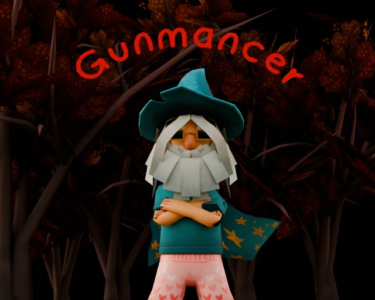

# LudumDare55

Play as a Gunmancer, a gun-slinging wizard with the ability to summon weapons.  
Shoot enemies to get blood to draw summoning circles. If an enemy or a dropped item is in the summon circle, when you finish it, you summon a gun with effects depending on the enemies and items in it.  
Repository for the [Ludum Dare 55](https://ldjam.com/events/ludum-dare/55).

## Controls

-Move: W,A,S,D or arrow keys  
-Shoot: left mouse button  
-Dash: space  
-Draw summoning circle : hold shift  

## Installation

### WebGL

Click on https://maartenbussler.itch.io/gunmancer and play the game in your browser.

### Local .Exe

- Download the latest release.
- Unzip `Build.zip` it and execute the `LudumDare.exe`.
